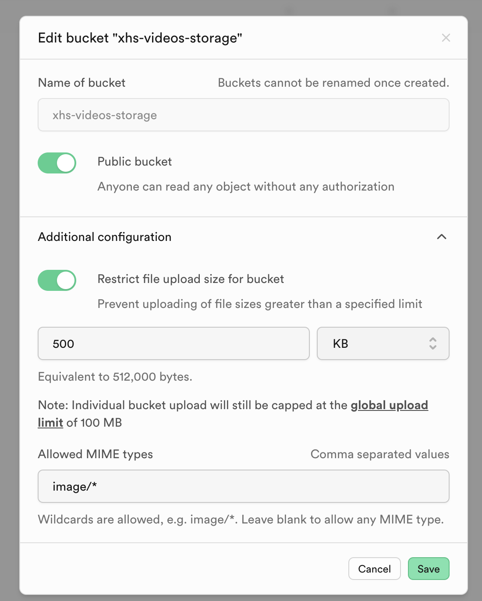

# xhs-download-videos

## About

> This software is used to download "your" liked videos, collected videos, and video notes from the Xiaohongshu APP.
> Set the download type and related parameters on the "Download Config" page, then click the "Download" button to start downloading.
>Downloaded videos will be saved to the "Downloaded Videos" page, where you can view and play the downloaded videos.

## Demo

<p></p>
<p></p>
<p></p>
<p></p>

## Preparation

1. create project `xhs-video` in supabase
2. create table `videos` in supabase

```
#table videos
CREATE TABLE videos (
    id bigint PRIMARY KEY,
    user_id text NOT NULL,
    created_at timestamp with time zone NOT NULL DEFAULT now(),
    updated_at timestamp with time zone DEFAULT now(),
    is_hidden boolean,
    is_synced boolean,
    video_src character varying,
    image_src character varying,
    uuid character varying,
    vid character varying,
    title character varying,
    type character varying,
    page_url character varying
);
```

3. change videos policies

<p></p>

4. create bucket `xhs-videos-storage` in supabase storage.
5. create folder `images` in `xhs-videos-storage` bucket
6. change bucket to be `public`

<p></p>

4. copy `.env.example` to generate `.env`, change .env paramaters

```
# get these paramaters from supabase Project Settings->Project API Keys

SUPABASE_URL=Project URL
SUPABASE_KEY=anon public
SUPABASE_STORAGE_BUCKET=xhs-videos-storage
```

## Installation

```
yarn
```

## Package for mac

```
yarn run build
yarn run dist-mac
```

## Package for windows

> maybe, it'll fail in mac. so please view .github/workflows/release.yml)
>
> You can package it in github->action.
> when you create a new release, it will trigger github action to package it.

```
yarn run build
yarn run dist-mac
```

## Make Icon(maybe, you don't need it)

```
mkdir icons/icon.iconset
#download .png variant size icon from https://www.iconarchive.com
cd icons
iconutil -c icns icon.iconset
rename icon.icns Custom-Icon-Design-Happy-Easter-Flower.icns
```

## Contact me
* Mail: qianzhiwei5921@gmail.com
* Telegram group: [https://t.me/xhs_video_downloader](https://t.me/xhs_video_downloader)

## Reference

* [create electron by react](https://medium.com/@azer.maslow/creating-desktop-applications-with-electron-and-react-b7f81f78c9d5)
* [csv to writer](https://www.npmjs.com/package/csv-writer)
* [webdriverio](https://v7.webdriver.io/docs/gettingstarted)
* [Icon](https://www.iconarchive.com/show/crayon-cute-icons-by-yohproject/box-full-icon.html)
* [基于Github Actions完成Electron自动打包、发布及更新](https://juejin.cn/post/7094865414353584164)
* [GitHub Action + Release：打造 Electron 持续交付系统](https://zhuanlan.zhihu.com/p/164901026)
* [my youdao note](https://note.youdao.com/s/Je8aMsd1)
* [Skip mac code signing](https://www.electron.build/code-signing.html)
* [bree task schedule](https://github.com/breejs/bree)
* [react-datetime-picker](https://github.com/wojtekmaj/react-datetime-picker)
* [bugsnag.com](https://app.bugsnag.com/)
* [ascci 2 utf8](https://onlinetools.com/utf8/convert-ascii-to-utf8)
