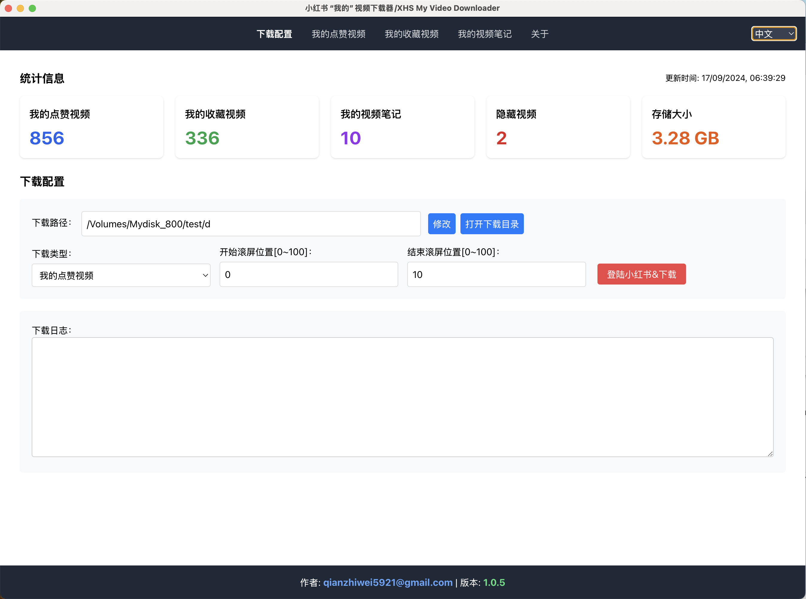
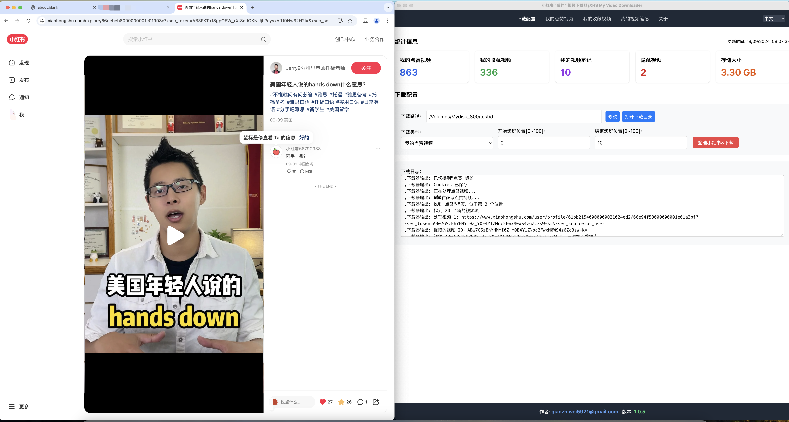
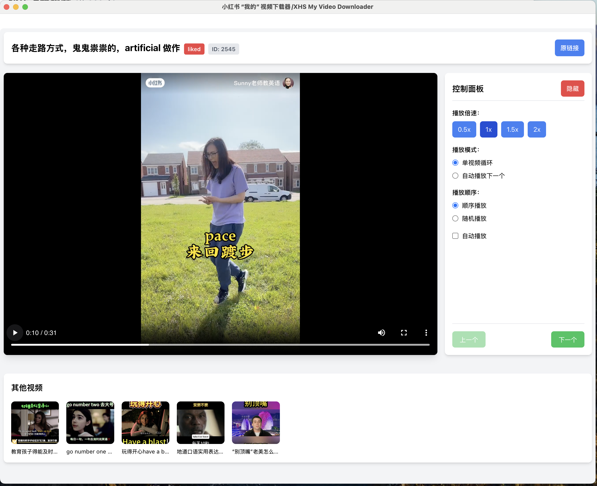

# xhs-download-videos

## About

该软件用于下载"您"在小红书APP的点赞视频、收藏视频、视频笔记。

通过"下载配置"页面，设置下载类型及相关参数，然后点击"下载"按钮，即可下载。

下载的视频会保存到"下载的视频"页面，您可以在这里查看及播放下载的视频。

## Demo

<p></p>
<p></p>
<p></p>
<p></p>

## Installation

```
yarn
```

## Package for mac

```
yarn run build
yarn run dist-mac
```

## Package for windows

> maybe, it'll fail in mac. so please view .github/workflows/release.yml)

```
yarn run build
yarn run dist
```
